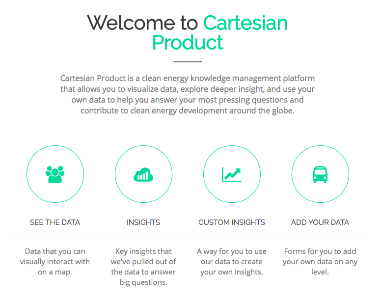
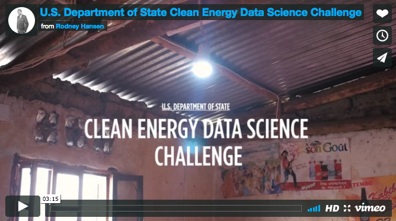
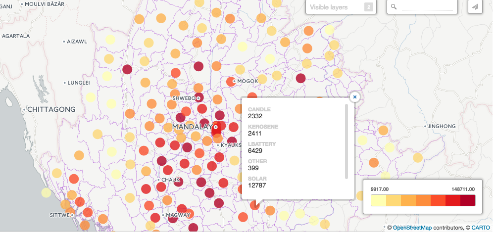
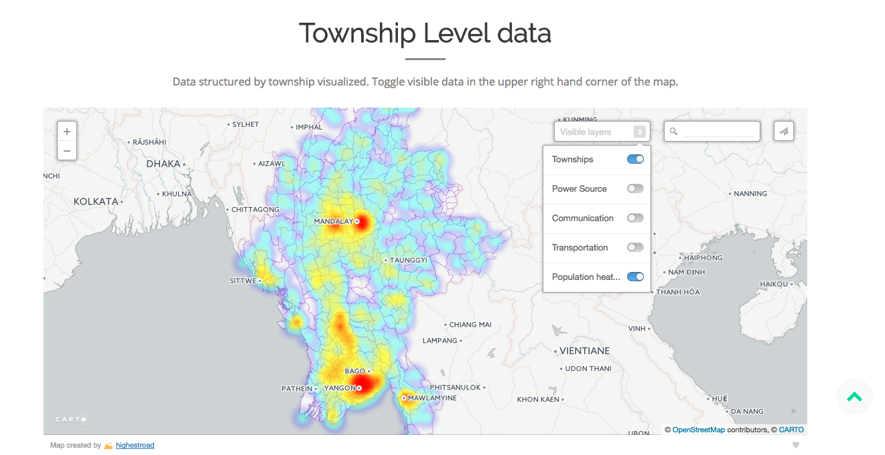
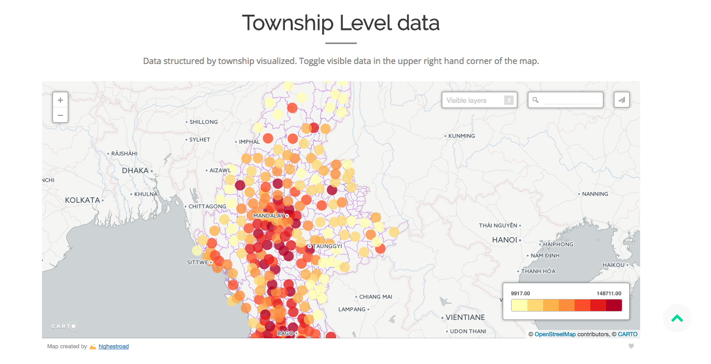

# About

This project is a response to the U.S. Department of State’s Clean Energy Data Science Challenge, co-hosted by Booz Allen Hamilton, the World Bank and Galvanize in San Francisco in April of 2017. Over the course of 48 hours, a team of seven data scientists and hackers put together a data product that helps impact investors identify promising markets for solar microgrid development in Myanmar. Here's the scoop:

_"Over 1 billion people around the world lack access to electricity and another billion lack access to reliable electricity. Providing access to energy can enable progress across the education, health, social, and economic sectors. Innovative and scalable solutions are needed to meet the drastically rising demand for electricity across the developing world, as well as the urgent imperative to significantly reduce global carbon emissions. One of the primary challenges is a lack of adequate financing for distributed energy projects — particularly from the private sector. A leading barrier to stimulating private finance is often a lack of access to reliable, real-time data and analysis about the country’s renewable energy development potential.
Companies and developers are also be hesitant to do business in countries that don’t have or provide information necessary for identifying renewable energy sites. They may be unable to afford conducting assessments themselves. And current methods for assessments, when conducted, can take months or years to assess where to complete."_

**-Zvika Krieger, US State Department**

# Product

Cartesian Product is a clean energy knowledge management platform that enables a diverse set of users to identify high-potential emerging energy markets. Beyond being a static ad-hoc analysis, the site includes a backend that lets researchers and surveyors contribute their own data to the platform. The vision was to crowd-source the collection of ground-truth data to domain experts: enabling future machine learning solutions to predict risk, reward, and social + environmental ROI.

We aggregated and distilled a diverse set of survey and geospatial data to derive metrics that answer the following questions:

1. Where are the regions with high photovoltaic (PV) potential?
2. Which townships are dense and affluent enough to be able to afford microgrid systems?
3. Where is the preexisting electricity grid likely to expand?

# Workflow:

This is a adaptable solution for any data beyond Myanmar(Burma).  But this is the overall process:

After the data is uploaded, you can look it at a Township level.  This can easily be changed to zip codes.

You can also look at subgroups as well.  For example, if you choose power source from the data menu you can click on a dot (colored by total power sources surveyed in a township) , you can view a breakdown of power source.

You can also use a heatmap by selecting data you want to display:

You can also check the Microgrid data and the distances to a power line, the closer it is to a power line the bigger the circle

You can also look at energy potential.  Shaded areas have higher potential as opposed to the lighter areas.

# Links:

Landing Page to our main site:

[Cartesian Product](http://cameronwkruse.com/cartesianproduct/)

Solar Potential for the Country:

[Solar Potential](http://cameronwkruse.com/cartesianproduct/solarpotential)

Main Grid Plan Layout:

[Main Grid Plan](http://cameronwkruse.com/cartesianproduct/maingridplan)

# Contributors
[CAMERON KRUSE](https://www.linkedin.com/in/krusecameron/) - Young Explorer

[VICTOR GARCIA](https://www.linkedin.com/in/evictorgarcia/)- Data Scientist

[MEHMET TURANALP](https://www.linkedin.com/in/mehmet-emin-turanalp/) - Software Engineer

[LUKMAAN BAWAZER](https://www.linkedin.com/in/lukmaanbawazer/) - Data Scientist

[ANTHONY ABERCROMBIE](https://www.linkedin.com/in/anthony-abercrombie-67264895/) - Geospatial Data Scientist

[ZACHARY THOMAS](https://www.linkedin.com/in/thomaszi/) - Data Scientist

[JASON CHIANG](https://www.linkedin.com/in/jachian22/) - Data Scientist

[BAOLIN LIU](https://www.linkedin.com/in/baolinliu/) - Data Scientist

Project Organization
------------

    ├── LICENSE
    ├── Makefile           <- Makefile with commands like `make data` or `make train`
    ├── README.md          <- The top-level README for developers using this project.
    ├── data
    │   ├── external       <- Data from third party sources.
    │   ├── interim        <- Intermediate data that has been transformed.
    │   ├── processed      <- The final, canonical data sets for modeling.
    │   └── raw            <- The original, immutable data dump.
    │
    ├── docs               <- A default Sphinx project; see sphinx-doc.org for details
    │
    ├── models             <- Trained and serialized models, model predictions, or model summaries
    │
    ├── notebooks          <- Jupyter notebooks. Naming convention is a number (for ordering),
    │                         the creator's initials, and a short `-` delimited description, e.g.
    │                         `1.0-jqp-initial-data-exploration`.
    │
    ├── references         <- Data dictionaries, manuals, and all other explanatory materials.
    │
    ├── reports            <- Generated analysis as HTML, PDF, LaTeX, etc.
    │   └── figures        <- Generated graphics and figures to be used in reporting
    │
    ├── requirements.txt   <- The requirements file for reproducing the analysis environment, e.g.
    │                         generated with `pip freeze > requirements.txt`
    │
    ├── src                <- Source code for use in this project.
    │   ├── __init__.py    <- Makes src a Python module
    │   │
    │   ├── data           <- Scripts to download or generate data
    │   │   └── make_dataset.py
    │   │
    │   ├── features       <- Scripts to turn raw data into features for modeling
    │   │   └── build_features.py
    │   │
    │   ├── models         <- Scripts to train models and then use trained models to make
    │   │   │                 predictions
    │   │   ├── predict_model.py
    │   │   └── train_model.py
    │   │
    │   └── visualization  <- Scripts to create exploratory and results oriented visualizations
    │       └── visualize.py
    │
    │
    ├── imgs                <- Images for this README.md
    └── tox.ini            <- tox file with settings for running tox; see tox.testrun.org

--------
